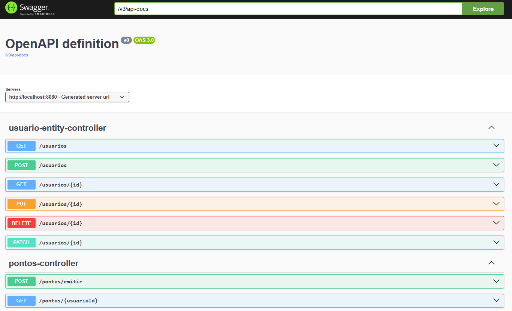
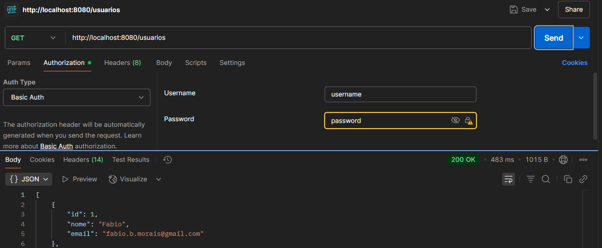
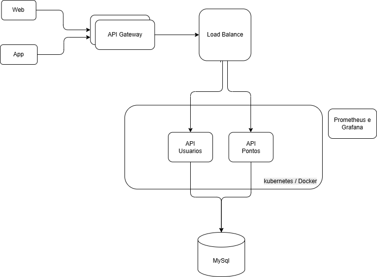

# Programa de Fidelidade para Supermercado

Este projeto é um MVP de um sistema de fidelidade para um supermercado de médio porte.  
O objetivo é aumentar a retenção de clientes e coletar dados sobre seus hábitos de compra.

## 🎯 Funcionalidades

- Cadastro de usuários interessados
- Emissão de pontos com base em compras
- Consulta de saldo de pontos acumulados

## 🧱 Arquitetura

- **Java 17**
- **Spring Boot**
- **MySql**
- **Clean Architecture + DDD**
- **Swagger**
- **Docker**
- **Monitoramento com Prometheus e Grafana**

## 🚀 Como executar localmente

### Pré-requisitos

- Docker
- Java 17
- Maven

## Acesse a documentação da API via Swagger em:
- http://localhost:8080/swagger-ui/index.html#/
- usuario: username
- senha: password
  





## 🧪 Testes
 - Para executar todos os testes:
   ```bash
   # Executar comando abaixo localmente
   ./mvnw test

## 📂 Estrutura do projeto
 - src/main/java/br/com/supermercado/fidelidade/aplicacao: Casos de uso (Application Layer)
 - src/main/java/br/com/supermercado/fidelidade/dominio: Entidades e regras de negócio (Domain Layer)
 - src/main/java/br/com/supermercado/fidelidade/infra: Repositórios, adaptadores e integrações (Infra Layer)
 - src/main/java/br/com/supermercado/fidelidade/interfaces: Controllers e APIs REST (Interface Layer)

## Visão macro da arquitetura do sistema


## 🛠️ Escolhas Tecnológicas e Justificativas

### 🔧 Back-end

- **Tecnologia escolhida:** Java 17 com Spring Boot 3.3  
- **Justificativa:**
  - Java 17 é uma versão LTS com melhorias de performance e recursos modernos.
  - Spring Boot simplifica a criação de APIs RESTful com robustez e escalabilidade.
  - Arquitetura baseada em DDD e Clean Architecture promove manutenção e organização.

### 🛢 Banco de Dados

- **Tecnologia escolhida:** MySql  
- **Justificativa:**
  - Banco de dados relacional amplamente utilizado, com excelente desempenho em ambientes web.
  - Compatível com Spring Data JPA e facilmente integrável ao ecossistema Spring.
  - Amplo suporte em provedores cloud como AWS RDS, Azure Database e Google Cloud SQL
  - Ideal para armazenar dados estruturados como pontos e usuários.

### ☁️ Infraestrutura e Serviços Gerenciados em Cloud

- **Serviços sugeridos:**
  - AWS RDS (MySql), EC2/Fargate (deploy), S3 (armazenamento de arquivos), CloudWatch/Prometheus+Grafana (monitoramento), Secrets Manager.
- **Justificativa:**
  - Redução de esforço operacional com serviços gerenciados.
  - Escalabilidade e resiliência em ambientes de produção.
  - Alta integração com ferramentas de CI/CD e segurança reforçada.


## ✅ Estratégias Técnicas

### 📌 Qualidade de Código e Testes

- Uso de Clean Architecture e DDD para melhor organização e manutenibilidade.
- Testes unitários com JUnit e Mockito para validar regras de negócio isoladamente.
- Estrutura modular, com uso de interfaces para facilitar testes e manutenção.

### ⚙️ Práticas DevOps sugeridas

- CI/CD com GitHub Actions ou Jenkins.
- Docker e Docker Compose para padronização de ambiente.
- Integração com SonarQube para análise de qualidade.
- Monitoramento com Prometheus + Grafana e logs com ELK Stack.

### 🔐 Segurança e Privacidade de Dados

- Uso de DTOs evita exposição indevida de entidades de domínio.
- Configurações sensíveis devem ser extraídas para variáveis de ambiente ou AWS Secrets Manager.
- Recomendado isolar banco e APIs em VPC privada com autenticação e controle de acesso.

## 👤 Autor
Fábio Borsato Morais

### Comandos

```bash
# Subir o ambiente com banco e serviços
docker run --detach --env MYSQL_ROOT_PASSWORD=password --env MYSQL_USER=user-fidelidade --env MYSQL_PASSWORD=password --env MYSQL_DATABASE=fidelidade --name mysql --publish 3306:3306 mysql:8-oracle

# Executar aplicação localmente
./mvnw spring-boot:run
